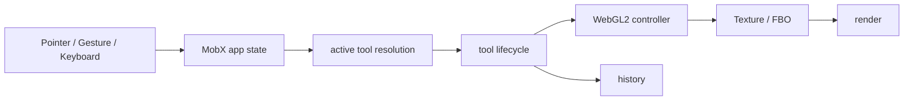
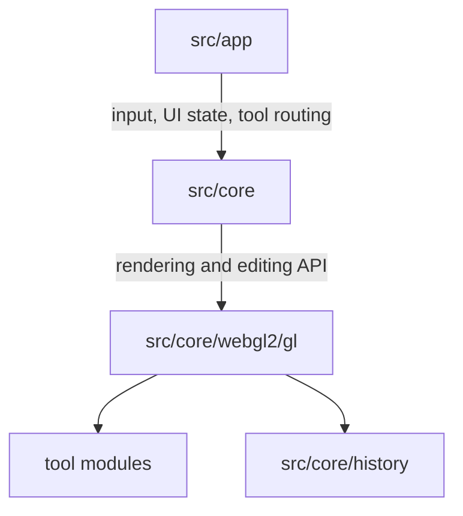

# painton.app

WebGL2 기반 웹 비트맵 이미지 편집기입니다. 맥북과 모바일 브라우저에서 가볍게 사용할 수 있는 그림판형 편집 도구를 목표로 만들고 있습니다.

- Service: https://painton.app
- Repository: https://github.com/oyc0401/graphic
- Stack: WebGL2, React, TypeScript, Vite, MobX, GLSL
- Period: 2024.10 ~

## 프로젝트 개요

painton.app은 브라우저에서 투명도 편집, 브러시, 선택 영역, 모자이크, 픽셀 유동화 같은 비트맵 편집 작업을 수행하는 웹 기반 이미지 에디터입니다.

처음에는 Canvas 2D 기반으로 시작했지만, CSS UI와 Canvas 2D 렌더링 타이밍 차이에서 오는 플리커링과 GPU 가속 제어의 한계가 있었습니다. 이후 WebGL2 기반 단일 렌더링 파이프라인으로 전면 마이그레이션했고, 텍스처/FBO 중심의 편집 구조 위에서 GPU 기반 도구를 확장하고 있습니다.

## 주요 기능

- 브러시, 연필, 지우개
- 사각형 선택, 자유 선택, 선택 영역 이동/변형
- 픽셀 유동화: push, rotate, bloat, pucker, restore
- 모자이크 편집 세션
- 도형, 색상 채우기, 색상 추출
- 이미지 열기, 저장, URL 기반 초기 이미지 로딩
- undo/redo 히스토리
- 데스크톱/모바일 UI와 핀치 줌, 멀티터치 제스처

## 구조





- `src/app`: React UI, DOM overlay, MobX state, 입력 라우팅
- `src/core`: 에디터 코어 API와 WebGL2 controller
- `src/core/webgl2/gl`: 렌더링, 텍스처, FBO, 도구 구현
- `src/core/history`: LZ4 압축 기반 픽셀 스냅샷과 undo/redo
- `scripts`: SEO HTML 생성 등 배포 보조 스크립트

## 기술적으로 신경 쓴 부분

### WebGL2 렌더링 파이프라인

Canvas 2D 기반 구현에서 WebGL2 중심 구조로 옮기면서 편집 결과를 텍스처/FBO 단위로 다루도록 정리했습니다. 브러시, 선택 영역, 모자이크, 픽셀 유동화가 같은 렌더링 경계 안에서 동작하고, 화면 출력은 WebGL 렌더 단계에서 처리합니다.

### 입력 이벤트와 도구 라이프사이클 분리

포인터 입력, 핀치 줌, undo/redo 제스처, 키보드 단축키가 도구 실행 로직에 직접 섞이지 않도록 입력을 공통 계층에서 정규화합니다. 이후 현재 앱 상태에 따라 활성 도구를 결정하고, `down / move / up / cancel` 라이프사이클로 전달합니다.

이 구조 덕분에 브러시, 선택, 리사이즈, 세션형 도구가 서로 다른 입력 조건을 가지더라도 같은 라우팅 흐름 안에서 동작합니다.

### React + DOM + MobX 상태 설계

초기 에디터의 DOM 기반 구조를 모두 버리지 않고, 앱바와 모바일 내비게이션처럼 복잡한 UI 영역에 React를 점진적으로 도입했습니다. React 컴포넌트와 캔버스 주변 DOM overlay가 같은 MobX state를 구독하도록 구성해, 기존 에디터 구조를 유지하면서 UI를 확장했습니다.

### 메모리-aware 히스토리

히스토리는 전체 이미지를 매번 저장하지 않고, 편집이 발생한 영역의 픽셀 스냅샷을 `PixelStore`에 저장합니다. `PixelStore`는 LZ4 압축을 사용하고, 히스토리 스택은 항목 수와 총 byte 크기를 함께 제한합니다.

### 세션 기반 편집

픽셀 유동화와 모자이크처럼 확정 전 미리보기가 필요한 도구는 `open -> edit -> commit/discard` 흐름으로 다룹니다. 세션 중에는 별도 텍스처에 편집 상태를 쌓고, 사용자가 확정했을 때만 레이어와 히스토리에 반영합니다.

### 픽셀 유동화 LUT

픽셀 유동화의 push 도구는 큰 브러시에서 드래그 중 적분을 직접 반복하지 않도록, 미리 계산한 2D primitive lookup texture를 사용합니다. 런타임 셰이더는 선분에 대한 signed primitive 차이를 lookup해 power를 구하고, 변위맵에 누적합니다.

자세한 알고리즘 설명은 [docs/liquify-lut.md](docs/liquify-lut.md)에 정리했습니다.

## 실행

```bash
pnpm install
pnpm dev
```

빌드:

```bash
pnpm build
```

테스트:

```bash
pnpm test
```

## 참고 파일

- App bootstrap: `src/app/main.tsx`
- 입력 라우팅: `src/app/events/gestureAdapter.ts`, `src/app/events/dispatchPointer.ts`
- 활성 도구 결정: `src/app/tools/activeTool.ts`
- WebGL2 controller: `src/core/webgl2/paintController.ts`
- 히스토리: `src/core/history/history.ts`, `src/core/history/PixelStore.ts`
- 픽셀 유동화 LUT: `src/core/webgl2/gl/tool/liquify/liquifyModule/displacementModule/liquifyLookup.ts`
- 픽셀 유동화 shader: `src/core/webgl2/gl/tool/liquify/liquifyModule/displacementModule/push.frag`
