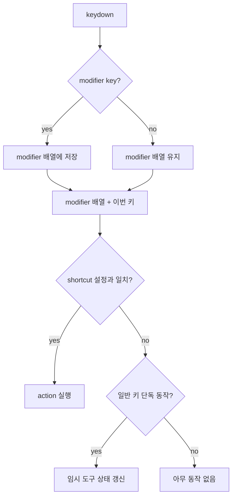
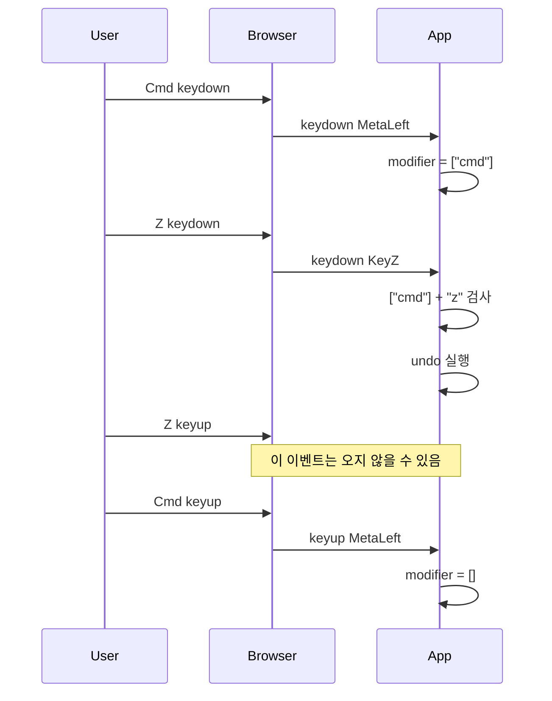

# 키보드 이벤트를 다시 바라본 기록

처음에는 키보드 처리가 단순해 보였다. `keydown`에서 키를 보고, `keyup`에서 키를 지우면 된다고 생각했다. `z`를 누르면 줌, `c`를 누르면 컬러 피커, `space`를 누르면 팬. 그리고 `cmd+z`나 `ctrl+z`는 undo. 이 정도면 작은 조건문 몇 개로 충분해 보였다.

하지만 실제로는 금방 복잡해졌다. `z`, `c`, `space`는 누르고 있는 동안 상태가 유지되는 키이고, `cmd+z`, `cmd+shift+z`, `cmd+delete`는 한 번 실행되는 단축키다. 둘을 같은 흐름에서 처리하다 보니 `cmd+z`를 눌렀는데 줌 도구가 켜지는 문제가 생겼다. `z`라는 키 하나만 보면 임시 줌이 맞지만, `cmd`와 함께 누른 `z`는 undo여야 했다.

그래서 단축키 설정을 따로 빼기 시작했다. `keyboardShortcutConfig.ts`에 action과 keys를 모아두고, `keyboardEvent.ts`는 그 설정을 해석하도록 바꿨다. 앞으로 유저가 키를 바꾸더라도 코드 여기저기에 조건문을 덧붙이지 않기 위해서였다.

중간에는 `trigger: "press"`나 `trigger: "hold"` 같은 구분을 둘까 고민했다. 하지만 그건 유저가 알아야 할 개념이 아니었다. 유저는 그냥 `temporaryZoom`을 어떤 키에 둘지, `setEraserTool`을 어떤 키에 둘지만 정하면 된다. 내부 동작 방식을 설정에 노출하면 키를 바꾸는 일이 필요 이상으로 어려워진다. 그래서 그런 필드는 두지 않기로 했다.

가장 큰 발견은 macOS의 `cmd+z`였다. 처음에는 앱 코드가 `KeyZ keyup`을 놓치는 줄 알았다. 그래서 raw keyboard event를 그대로 콘솔에 찍었다.

```ts
console.log("[keyboard:raw]", phase, event);
```

그 결과는 명확했다. `cmd+z`를 누르고 뗐는데 raw 이벤트에도 `KeyZ keyup`이 오지 않았다. 브라우저가 이벤트를 아예 주지 않은 것이다. 이 경험 때문에 pressed 배열에 일반 키까지 저장하는 방식이 맞지 않다는 걸 알게 됐다. `z`의 keyup이 오지 않으면, 앱 입장에서는 사용자가 아직 `z`를 누르고 있다고 볼 수밖에 없기 때문이다.

그래서 배열에는 modifier만 넣기로 했다. 지금은 `cmd`, `ctrl`, `shift`만 순서대로 저장한다. 일반 키는 배열에 넣지 않는다. 대신 `keydown` 순간에 현재 modifier 배열과 이번 키를 합쳐 단축키를 검사한다.



예를 들어 macOS에서 `cmd+shift+z`를 누르면 상태는 이렇게 된다.

```txt
cmd down   -> ["cmd"]
shift down -> ["cmd", "shift"]
z down     -> ["cmd", "shift"] + "z"
```

여기서 만들어진 후보 키 배열은 `["cmd", "shift", "z"]`이고, 설정에 있는 redo 단축키와 일치하면 redo를 실행한다. `z`는 pressed 배열에 들어가지 않으므로 `KeyZ keyup`이 오지 않아도 앱이 `z`를 계속 누르고 있다고 착각하지 않는다.



또 하나 정리한 것은 `cmd`와 `ctrl`을 분리한 일이다. 처음에는 macOS의 `Command`도 내부적으로 `ctrl`로 취급했다. 빨리 처리하기에는 편했지만 정확하지 않았다. `cmd`와 `ctrl`은 다른 키이고, 유저 커스터마이징에서도 별개로 다뤄져야 한다. 그래서 `MetaLeft`, `MetaRight`는 `cmd`로, `ControlLeft`, `ControlRight`는 `ctrl`로 매핑했다.

기본 단축키는 플랫폼에 따라 다르게 잡았다.

```ts
const systemModifierKey = isMacPlatform ? "cmd" : "ctrl";
```

macOS에서는 `cmd+z`, Windows/Linux에서는 `ctrl+z`가 기본이다. 둘 다 항상 켜두는 방식도 가능하지만, 기본값은 플랫폼 관습을 따르는 쪽이 자연스럽다.

이 작업을 하면서 배운 점은 키보드 이벤트를 raw input처럼 믿으면 안 된다는 것이다. 웹의 `KeyboardEvent`는 OS와 브라우저를 거쳐 페이지에 도착한 이벤트다. 특히 `cmd` 같은 시스템 modifier가 들어가면 이벤트가 기대한 down/up 쌍으로 오지 않을 수 있다. 그래서 상태를 직접 관리할 때는 “어떤 키를 오래 저장해도 되는가”를 먼저 정해야 한다.

현재 결론은 단순하다.

```txt
modifier는 배열에 저장한다.
일반 키는 keydown 순간에만 shortcut scan에 사용한다.
cmd와 ctrl은 별개 키로 취급한다.
shortcut 설정은 action과 keys만 가진다.
```

이 구조 덕분에 `z -> c -> z up` 같은 임시 도구 흐름은 유지하면서도, `cmd+z`의 `KeyZ keyup` 누락 문제는 피할 수 있게 됐다. 키보드 코드는 작아 보이지만, 실제로는 브라우저와 운영체제의 경계에 걸쳐 있다. 이번 수정은 그 경계를 코드에 조금 더 솔직하게 반영한 작업이었다.
